# Harness-Methodology: Phase 1–8 E2E Flow (Mermaid)

```mermaid
flowchart TD
    START([Session Start]) --> P1[<b>Phase 1: Requirements</b><br/>Artifact: SRS.md]
    
    P1 --> P1_ENTRY["Entry: None<br/>(no predecessor)"]
    P1_ENTRY --> P1_WORK["💼 A/B Work:<br/>REQUIREMENTS_ENGINEER<br/>BUSINESS_ANALYST<br/><br/>📝 Output: SRS.md"]
    P1_WORK --> P1_GATE["🔒 Exit: Human¹<br/>Review SRS.md<br/>APPROVE / REJECT"]
    
    P1_GATE -->|APPROVE| P1_PUSH["✅ git push<br/>phase1 COMPLETE"]
    P1_GATE -->|REJECT| P1_WORK
    P1_PUSH --> P2_START["📋 Next: Phase 2<br/>plan-phase --phase 2"]
    
    P2_START --> P2[<b>Phase 2: Architecture</b><br/>Artifact: SAD.md + ADR.md]
    
    P2 --> P2_ENTRY["Entry: Human¹ APPROVE<br/>(from P1)"]
    P2_ENTRY --> P2_WORK["💼 A/B Work:<br/>ARCHITECT<br/>TECH_LEAD<br/><br/>📝 Output: SAD.md<br/>ADR.md"]
    P2_WORK --> P2_GATE["🔒 Exit: Human¹<br/>Review SAD.md<br/>APPROVE / REJECT"]
    
    P2_GATE -->|APPROVE| P2_MANIFEST["📊 Generate<br/>quality_manifest.json"]
    P2_GATE -->|REJECT| P2_WORK
    P2_MANIFEST --> P2_PUSH["✅ git push<br/>phase2 COMPLETE<br/>sad_path now exists"]
    P2_PUSH --> P3_START["📋 Next: Phase 3<br/>plan-phase --phase 3"]
    
    P3_START --> P3[<b>Phase 3: Implementation</b><br/>Dynamic FR loop]
    
    P3 --> P3_ENTRY["Entry: Human¹ APPROVE<br/>(from P2)"]
    P3_ENTRY --> P3_WORK["💼 A/B Loop (per FR):<br/>DEVELOPER<br/>REVIEWER<br/><br/>📝 TDD: RED → GREEN"]
    P3_WORK --> P3_G1["🔒 Gate 1 (per FR):<br/>linting(90)<br/>type_safety(85)<br/>coverage(80)<br/>score ≥ 75"]
    P3_G1 -->|PASS| P3_PUSH1["✅ git push<br/>CHECKPOINT-K"]
    P3_G1 -->|FAIL| P3_FIX["🔧 Fix dimension<br/>[max 3 rounds]"]
    P3_FIX --> P3_G1
    
    P3_PUSH1 --> P3_NEXT_FR{All FRs<br/>complete?}
    P3_NEXT_FR -->|No| P3_WORK
    P3_NEXT_FR -->|Yes| P3_G2["🔒 Gate 2: Phase Exit<br/>7 dims<br/>score_gate ≥ 75"]
    
    P3_G2 -->|PASS| P3_G2D["✅ git push<br/>phase3 COMPLETE<br/>[FSM] → DONE"]
    P3_G2 -->|CONTINUE| P3_FIX2["🔧 Fix"]
    P3_G2 -->|PLATEAU| P3_DEFER["📌 deferred_fixes.md"]
    P3_G2 -->|BLOCKED| P3_ESCALATE["⚠️ GateBlockedError<br/>escalate to human"]
    
    P3_FIX2 --> P3_G2
    P3_DEFER --> P3_G2D
    P3_ESCALATE --> P3_G2D
    
    P3_G2D --> P4_START["📋 Next: Phase 4<br/>plan-phase --phase 4"]
    
    P4_START --> P4[<b>Phase 4: Testing</b><br/>Dynamic FR loop]
    
    P4 --> P4_ENTRY["Entry: Gate 2 PASS<br/>(from P3)"]
    P4_ENTRY --> P4_WORK["💼 A/B Loop (per FR):<br/>QA_ENGINEER<br/>ARCHITECT<br/><br/>📝 Execute TEST_PLAN.md"]
    P4_WORK --> P4_G1["🔒 Gate 1 (per FR):<br/>linting/type_safety<br/>coverage ≥ 80%<br/>score ≥ 75"]
    P4_G1 -->|PASS| P4_PUSH1["✅ git push<br/>CHECKPOINT-K"]
    P4_G1 -->|FAIL| P4_FIX["🔧 Fix"]
    P4_FIX --> P4_G1
    
    P4_PUSH1 --> P4_NEXT_FR{All FRs<br/>complete?}
    P4_NEXT_FR -->|No| P4_WORK
    P4_NEXT_FR -->|Yes| P4_G3["🔒 Gate 3: Phase Exit<br/>12 dims<br/>score_gate ≥ 80<br/>[CRG recon]"]
    
    P4_G3 -->|PASS| P4_G3D["✅ git push<br/>TEST_RESULTS.md<br/>phase4 COMPLETE"]
    P4_G3 -->|CONTINUE| P4_FIX2["🔧 Fix"]
    P4_G3 -->|PLATEAU| P4_DEFER["📌 deferred_fixes.md"]
    P4_G3 -->|BLOCKED| P4_ESCALATE["⚠️ escalate"]
    
    P4_FIX2 --> P4_G3
    P4_DEFER --> P4_G3D
    P4_ESCALATE --> P4_G3D
    
    P4_G3D --> P5_START["📋 Next: Phase 5<br/>plan-phase --phase 5"]
    
    P5_START --> P5[<b>Phase 5: Verification</b><br/>Dynamic FR loop]
    
    P5 --> P5_ENTRY["Entry: Gate 3 PASS<br/>(from P4)"]
    P5_ENTRY --> P5_WORK["💼 A/B Loop (per FR):<br/>DEVELOPER<br/>REVIEWER<br/><br/>📝 Verify acceptance criteria"]
    P5_WORK --> P5_G1["🔒 Gate 1 (per FR)<br/>score ≥ 75"]
    P5_G1 -->|PASS| P5_PUSH1["✅ git push"]
    P5_G1 -->|FAIL| P5_FIX["🔧 Fix"]
    P5_FIX --> P5_G1
    
    P5_PUSH1 --> P5_NEXT_FR{All FRs<br/>complete?}
    P5_NEXT_FR -->|No| P5_WORK
    P5_NEXT_FR -->|Yes| P5_G3["🔒 Gate 3: Phase Exit<br/>12 dims<br/>score_gate ≥ 80"]
    
    P5_G3 -->|PASS| P5_G3D["✅ git push<br/>BASELINE.md<br/>phase5 COMPLETE"]
    P5_G3 -->|CONTINUE| P5_FIX2["🔧 Fix"]
    P5_G3 -->|PLATEAU| P5_DEFER["📌 deferred_fixes.md"]
    
    P5_FIX2 --> P5_G3
    P5_DEFER --> P5_G3D
    
    P5_G3D --> P6_START["📋 Next: Phase 6<br/>plan-phase --phase 6"]
    
    P6_START --> P6[<b>Phase 6: QA</b><br/>Dynamic FR loop]
    
    P6 --> P6_ENTRY["Entry: Gate 3 PASS<br/>(from P5)"]
    P6_ENTRY --> P6_WORK["💼 A/B Loop:<br/>QA_ENGINEER<br/>DEVOPS<br/><br/>📝 QUALITY_REPORT.md"]
    P6_WORK --> P6_G1["🔒 Gate 1 (per FR)<br/>score ≥ 75"]
    P6_G1 -->|PASS| P6_PUSH1["✅ git push"]
    P6_G1 -->|FAIL| P6_FIX["🔧 Fix"]
    P6_FIX --> P6_G1
    
    P6_PUSH1 --> P6_NEXT_FR{All FRs<br/>complete?}
    P6_NEXT_FR -->|No| P6_WORK
    P6_NEXT_FR -->|Yes| P6_G4["🔒 Gate 4: Phase Exit<br/>12 dims<br/>score_gate ≥ 85<br/>[CRG recon]<br/>[Hermes APPROVE]"]
    
    P6_G4 -->|PASS| P6_G4D["✅ git push<br/>phase6 COMPLETE"]
    P6_G4 -->|CONTINUE| P6_FIX2["🔧 Fix"]
    P6_G4 -->|PLATEAU| P6_DEFER["📌 deferred_fixes.md"]
    
    P6_FIX2 --> P6_G4
    P6_DEFER --> P6_G4D
    
    P6_G4D --> P7_START["📋 Next: Phase 7<br/>plan-phase --phase 7"]
    
    P7_START --> P7[<b>Phase 7: Risk Mgmt</b><br/>Dynamic FR loop]
    
    P7 --> P7_ENTRY["Entry: Gate 4 PASS<br/>(from P6)"]
    P7_ENTRY --> P7_WORK["💼 A/B Loop:<br/>DEVOPS<br/>ARCHITECT<br/><br/>📝 RISK_REGISTER.md"]
    P7_WORK --> P7_G1["🔒 Gate 1 (per FR)<br/>score ≥ 75"]
    P7_G1 -->|PASS| P7_PUSH1["✅ git push"]
    P7_G1 -->|FAIL| P7_FIX["🔧 Fix"]
    P7_FIX --> P7_G1
    
    P7_PUSH1 --> P7_NEXT_FR{All FRs<br/>complete?}
    P7_NEXT_FR -->|No| P7_WORK
    P7_NEXT_FR -->|Yes| P7_G3["🔒 Gate 3: Phase Exit<br/>12 dims<br/>score_gate ≥ 80"]
    
    P7_G3 -->|PASS| P7_G3D["✅ git push<br/>phase7 COMPLETE"]
    P7_G3 -->|CONTINUE| P7_FIX2["🔧 Fix"]
    
    P7_FIX2 --> P7_G3
    
    P7_G3D --> P8_START["📋 Next: Phase 8<br/>plan-phase --phase 8"]
    
    P8_START --> P8[<b>Phase 8: Config Mgmt</b><br/>Dynamic FR loop]
    
    P8 --> P8_ENTRY["Entry: Gate 3 PASS<br/>(from P7)"]
    P8_ENTRY --> P8_WORK["💼 A/B Loop:<br/>DEVOPS<br/>ARCHITECT<br/><br/>📝 CONFIG_RECORDS.md"]
    P8_WORK --> P8_G1["🔒 Gate 1 (per FR)<br/>score ≥ 75"]
    P8_G1 -->|PASS| P8_PUSH1["✅ git push"]
    P8_G1 -->|FAIL| P8_FIX["🔧 Fix"]
    P8_FIX --> P8_G1
    
    P8_PUSH1 --> P8_NEXT_FR{All FRs<br/>complete?}
    P8_NEXT_FR -->|No| P8_WORK
    P8_NEXT_FR -->|Yes| P8_END["🎉 Pipeline Complete<br/>Archive .methodology/"]
    
    P8_END --> END([End])
    
    style P1 fill:#e1f5ff
    style P2 fill:#f3e5f5
    style P3 fill:#fff3e0
    style P4 fill:#fce4ec
    style P5 fill:#f1f8e9
    style P6 fill:#ede7f6
    style P7 fill:#e0f2f1
    style P8 fill:#fbe9e7
    
    style P1_GATE fill:#ffccbc
    style P2_GATE fill:#ffccbc
    style P3_G1 fill:#ffb74d
    style P3_G2 fill:#ff8a65
    style P4_G1 fill:#ffb74d
    style P4_G3 fill:#ff5722
    style P5_G1 fill:#ffb74d
    style P5_G3 fill:#ff8a65
    style P6_G1 fill:#ffb74d
    style P6_G4 fill:#c62828
    style P7_G1 fill:#ffb74d
    style P7_G3 fill:#ff8a65
    style P8_G1 fill:#ffb74d
```

---

## Legend

| Symbol | Meaning |
|--------|---------|
| `💼 A/B Work` | Agent A + Agent B collaboration |
| `🔒 Gate` | Automated quality gate evaluation |
| `🔧 Fix` | Auto-fix loop (max 3 rounds) |
| `✅` | Checkpoint push / approval |
| `⚠️` | Escalation to human |
| `📝` | Output artifact |
| `📊` | Generated manifest |
| `📋` | Next phase command |
| `🎉` | Pipeline complete |

---

## Phase Entry/Exit Matrix

| Phase | Entry Condition | Exit Gate | Exit Score | Artifacts |
|-------|---|---|---|---|
| **P1** | None | Human¹ | N/A | SRS.md |
| **P2** | Human¹ (P1) | Human¹ | N/A | SAD.md, ADR.md, quality_manifest.json |
| **P3** | Human¹ (P2) | Gate 2 | ≥ 75 | Code + sessions_spawn.log |
| **P4** | Gate 2 (P3) | Gate 3 | ≥ 80 | TEST_RESULTS.md |
| **P5** | Gate 3 (P4) | Gate 3 | ≥ 80 | BASELINE.md |
| **P6** | Gate 3 (P5) | Gate 4 | ≥ 85 | QUALITY_REPORT.md |
| **P7** | Gate 4 (P6) | Gate 3 | ≥ 80 | RISK_REGISTER.md |
| **P8** | Gate 3 (P7) | None | N/A | CONFIG_RECORDS.md |

---

## Auto-Generated

- Source: `scripts/generate_full_plan.py`
- Format: Mermaid Flowchart
- Last Updated: 2026-05-06
- Validation: See `tests/test_harness_phase_flowchart.py`
