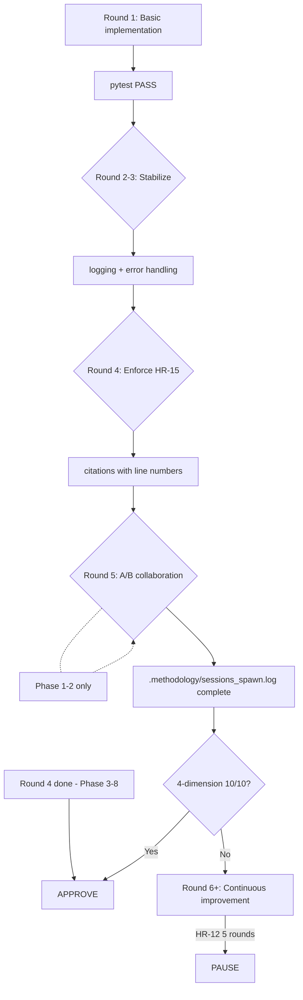

# Phase {PHASE} Execution Plan — {PROJECT_NAME}

> **Version**: {VERSION}
> **Project**: {PROJECT_NAME}
> **Date**: {DATE}
> **Framework**: harness-methodology {VERSION}
> **Status**: Pending Johnny confirmation to start

---

## 0. Execution Protocol (§0)

```
[Step 0] READ .methodology/state.json → current_phase={PHASE}
[Step 1] LOAD SKILL.md §4 Phase routing
[Step 2] CHECK entry conditions → blocker → STOP
[Step 3] EXECUTE SOP → LAZY LOAD docs/P{PHASE}_SOP.md
[Step 4] RECORD output | SPAWN A/B agent
[Step 5] CHECK exit conditions → fail → FIX + RETRY
[Step 6] UPDATE state.json phase={PHASE_PLUS_1} → GOTO 1
```

**CLI Commands**:
```bash
python3 harness_cli.py run-phase --phase {PHASE} --project .
python3 harness_cli.py push-checkpoint --phase {PHASE}  # P1/P2: save deliverable checkpoint
python3 harness_cli.py push-milestone   --phase {PHASE} --type <type>  # P3+: REQUIRED before git push (CI push-milestone-enforcement blocks otherwise)
python3 harness_cli.py run-gate --gate 1 --phase {PHASE} --fr-id FR-XX
python3 harness_cli.py generate-next-plan --phase {PHASE}
```

---

## ⛔ [CHECKPOINT-0] Entry Gate — Pre-flight Verification

Agent MUST stop here and verify before any work begins.

- [ ] 執行 `python3 harness_cli.py run-phase --phase {PHASE} --project .`
- [ ] 確認 entry gate PASS（kill-switch 關閉、FSM 狀態正確、前置 phase artifacts 存在）
- [ ] 確認 `.methodology/state.json` current_phase={PHASE}
- [ ] ⛔ 未經用戶明確確認，不得開始任何開發工作

---

## ⛔ [CHECKPOINT-1] Per-FR Gate 1 Evaluation

For each FR, Agent MUST stop at the gate evaluation point. DO NOT advance past
a failing gate.

- [ ] 執行 `python3 harness_cli.py run-gate --gate 1 --phase {PHASE} --fr-id FR-XX`
- [ ] Claude 評估 gate 結果並寫入 `.sessi-work/gate1_result.json`
- [ ] 執行 `python3 harness_cli.py finalize-gate --gate 1 --phase {PHASE} --fr-id FR-XX`
- [ ] **[D4-BACKWARD]** D4 backward spec-coverage-check (Gate 1 threshold 40%; applies P3+):
  ```bash
  python3 harness_cli.py spec-coverage-check --project . --threshold 40.0 --fr-id FR-XX
  ```
  FAIL → fix missing test implementations → re-run
- [ ] 確認 gate PASS（each dimension ≥ threshold per SKILL.md §2）
- [ ] Gate FAIL → AutoFixEngine retry (up to `--auto-fix-rounds`) → re-check
- [ ] Auto-fix exhausted → escalate to human (see SAD.md §3.18 for 9 escalation conditions)
- [ ] ⛔ 未經用戶明確確認，不得繼續下一個 FR

---

## ⛔ [CHECKPOINT-2] Phase Exit Gate Evaluation

Agent MUST stop here. DO NOT advance phase without exit gate PASS.

- [ ] 執行 `python3 harness_cli.py run-gate --gate {EXIT_GATE_NUM} --phase {PHASE}`
- [ ] Claude 評估 gate 結果並寫入 `.sessi-work/gate{EXIT_GATE_NUM}_result.json`
- [ ] 執行 `python3 harness_cli.py finalize-gate --gate {EXIT_GATE_NUM} --phase {PHASE}`
- [ ] **[D4-BACKWARD]** D4 backward spec-coverage-check (Gate 2=40%, Gate 3=70%; see CONSTITUTION.md §2.2):
  ```bash
  # Gate 2 (P3 exit) → --threshold 40.0 ; Gate 3 (P4 exit) → --threshold 70.0
  python3 harness_cli.py spec-coverage-check --project . --threshold {SPEC_COVERAGE_THRESHOLD}
  ```
  FAIL → fix missing test implementations → re-run
- [ ] 確認 gate PASS（score ≥ threshold per SKILL.md §1）
- [ ] Gate FAIL → 修復 → 重新評估（HR-08: 不得跳過失敗的 gate）
- [ ] Phase Truth ≥ 90%（HR-11）
- [ ] ⛔ 未經用戶明確確認，不得更新 state.json 進入下一 Phase

---

## ⛔ [CHECKPOINT-3] P8-Only: Archive & HANDOVER Finalization

> **僅適用 Phase 8。** 其他 Phase 略過此段。

- [ ] **[P8-ARCHIVE]** 建立 `.methodology-archive/` (CI `p8-archive-check` 驗證):
  ```bash
  mkdir -p .methodology-archive && cp -r .sessi-work/ .methodology-archive/
  ```
- [ ] **[P8-HANDOVER]** 確認 `HANDOVER.md` 無 Phase 9 引用:
  ```bash
  grep -qi "phase 9\|phase9\|phase9_plan" HANDOVER.md && echo "ERROR: Phase 9 refs found — remove them" || echo "OK: no Phase 9 refs"
  ```

---

## Hook Definitions (v2.4+)

Lifecycle hooks are optional shell/Python commands that execute at specific phase/gate/FR events.
Hooks are defined in `.methodology/hooks.json` and executed by `core/lifecycle_hooks.HookRunner`.

**Supported events**: `before_phase`, `after_gate_pass`, `on_gate_fail`, `on_escalate`, `after_fr_complete`, `before_phase_advance`

**Failure semantics**:
| Event | Hook failure behavior |
|-------|----------------------|
| `before_phase` | Fatal — abort phase start |
| `after_gate_pass` | Logged and ignored |
| `on_gate_fail` | Logged and ignored |
| `on_escalate` | Logged and ignored |
| `after_fr_complete` | Logged and ignored |
| `before_phase_advance` | Fatal — block phase advance |

**Example `.methodology/hooks.json`**:
```json
{
  "hooks": [
    {"name": "lint-check", "event": "before_phase", "command": "ruff check .", "timeout": 30, "required": true},
    {"name": "coverage-report", "event": "after_fr_complete", "command": "python -m pytest --cov=app/ --cov-report=term -q", "timeout": 120},
    {"name": "notify-gate-fail", "event": "on_gate_fail", "command": "echo 'Gate failed' >> .methodology/alerts.log"}
  ]
}
```

---

## 1. Hard Rules (HR-01~HR-15)

| HR | Rule | Consequence | Action |
|----|------|-------------|--------|
| HR-01 | A/B must be different Agents; self-review forbidden **[Phase 1-2]** | Terminate -25 | Developer spawn → Reviewer spawn (strict order) |
| HR-02 | Quality Gate requires actual command output | Terminate -20 | Save stdout for each QG |
| HR-03 | Phases execute in order; skipping forbidden | Terminate -30 | state.json phase={PHASE} |
| HR-04 | HybridWorkflow mode=ON, A/B mandatory **[Phase 1-2]** | Terminate | prompt includes mode=ON |
| HR-05 | On conflict, harness-methodology takes priority | Log | methodology wins disputes |
| HR-06 | External frameworks outside spec are forbidden | Terminate -20 | forbidden list |
| HR-07 | DEVELOPMENT_LOG must record session_id | -15 | Log session_id per entry |
| HR-08 | Phase end requires Quality Gate execution | Terminate -10 | stage-pass --phase {PHASE} |
| HR-09 | Claims Verifier must pass | Terminate -20 | citations cross-check |
| HR-10 | .methodology/sessions_spawn.log must have A/B records **[Phase 1-2]** | Terminate -15 | 2 entries per step |
| HR-11 | Phase Truth < 90% blocks next Phase entry | Terminate | <90% → PAUSE |
| HR-12 | A/B review > 5 rounds → PAUSE **[Phase 1-2]** | — | Stop proactively at round 5 |
| HR-13 | Phase execution > 3x estimate → PAUSE | — | Record start_time |
| HR-14 | Integrity < 40 → FREEZE | — | Check Integrity after QG |
| HR-15 | citations must include line numbers + artifact_verification | -15 | No citations = task failure |

---

## 2. A/B Collaboration (Phase 1-2 Only)

> **Phase 3-8**: A/B is replaced by automated **Phase End Audit** (see `scripts/phase_end_audit.py`).
> Run `python3 scripts/phase_end_audit.py --phase {PHASE} --project .` at phase completion.

### On Demand / Need to Know Principles

| Principle | Definition |
|-----------|------------|
| **Need to Know** | Provide only necessary information; L1/NFR supplied only when asked |
| **On Demand** | Sub-agent reads artifact paths itself; no dumping |
| **Single Responsibility** | Each Sub-agent handles one FR only |

### HR Constraints (Phase {PHASE})
{HR_LIST}

### TH Thresholds (Phase {PHASE})
{TH_LIST}

### A/B Roles (Phase {PHASE}) [Phase 1-2 Only]

| Role | Agent | Responsibility |
|------|-------|----------------|
| **Agent A** | `{AGENT_A}` | Primary implementation |
| **Agent B** | `{AGENT_B}` | Review and verification |

### TH Threshold Details

{TH_THRESHOLDS_TABLE}

---

## 2.5 Task Decomposition (Dependency Analysis)

> **Phases 1-2**: Deliverables have sequential dependencies. Each must pass Agent B review
> before the next one starts. REJECT only backtracks one step — earlier APPROVED deliverables
> are not re-opened.

**Decomposition rules**:
1. List all phase deliverables before starting any work
2. Identify dependencies: which deliverables require others as input?
3. Order by dependency (topological sort) — no circular dependencies allowed
4. If a deliverable is complex (>2000 characters estimated output), split into sub-parts
5. Execute serial A/B per deliverable in dependency order

**Execution contract**:
- Sub-Task N/Total: deliverable → Agent A writes → Agent B reviews → APPROVE → next
- REJECT on Sub-Task N → fix ONLY that deliverable → re-dispatch Agent B (max 5 rounds, HR-12)
- Earlier APPROVED deliverables are locked — no cascade rework

---

## 2.6 P2-Specific: TEST_SPEC.md Generation (Required before P2 exit)

> **Applies to Phase 2 only.** Skip this section for all other phases.

After SAD.md and ADR.md are APPROVED by Agent B, Agent A (ARCHITECT) MUST generate
`02-architecture/TEST_SPEC.md` using the `derive_test_cases.md` skill.

**Steps**:
1. Read the full `derive_test_cases.md` skill at `harness/ssi/prompts/derive_test_cases.md`
2. Execute Step 1 of the skill: scan SRS §3 NFRs → build Active Pattern Set
3. Execute Step 2 for every FR in SRS §2: 7-Question Protocol (Q1~Q7)
4. Write `02-architecture/TEST_SPEC.md` following the format in Step 3
5. Add the Cross-Cutting section (Step 4) and Summary table (Step 5)
6. Agent B validates TEST_SPEC.md against the Agent B Validation Checklist in the skill

**Verification command** (after P3 begins implementing tests):
```bash
python3 harness_cli.py spec-coverage-check --project . --threshold 40.0
```

**Gate thresholds for spec-coverage**:
| Gate | Threshold | When checked |
|------|-----------|--------------|
| Gate 1 (per-FR) | 40% | Each FR in P3 |
| Gate 2 (P3 exit) | 40% | P3 complete |
| Gate 3 (P4 exit) | 70% | P4 complete |
| Gate 4 (P6 full) | 90% | P6 complete |

**P2 exit is blocked if TEST_SPEC.md is absent or contains no test cases.**

---

## 3. FR-by-FR Task Table ({FR_COUNT} total)

{FR_TABLE_ROWS}

---

## 3.5 Previous Phase Artifact Handover (Phase {PHASE} prerequisites)

{artifacts_summary}

---

## 4. Output Structure Tree

```
{DELIVERABLE_STRUCTURE}
```

> Source: parsed from SRS.md FR requirements + SAD.md module mapping

### Deliverable Checklist

```markdown
{DELIVERABLE_CHECKLIST}
```

---

## 5. FR Detailed Tasks ({FR_COUNT} total)

> FR detailed tasks require parsing SRS.md §FR-XX
> Full content: `.methodology/plans/phase{PHASE}_FULL.md`
> To generate detailed tasks, add `--detailed` flag

{FR_DETAILED_TASKS}

---

## 6. External Documents

{EXTERNAL_DOCS}

---

## 7. Agent Prompt Templates

### Agent A (determined by Phase)
Agent A role is determined by Phase:
- Phase 1: requirements
- Phase 2-3: architect/developer
- Phase 4: tester
- Phase 5: developer
- Phase 6: qa
- Phase 7: devops
- Phase 8: devops

### Agent B (determined by Phase) [Phase 1-2 Only]
Agent B role is determined by Phase:
- Phase 1-2: architect/reviewer
- Phase 3-8: *(not used — Phase End Audit替代)*

See each Phase's output documents for detailed prompts.

```
{DEVELOPER_PROMPT}
```

### Agent B (Reviewer) [Phase 1-2 Only]

```
{REVIEWER_PROMPT}
```

```
===============================================
TASK: FR-{FR_NUM} {MODULE_NAME}
TASK_ID: task-{FR_NUM_ZF}
===============================================

PROMPT (self-read):
- SRS.md (§FR-{FR_NUM})
- 02-architecture/SAD.md (§Module boundary mapping table)

OUTPUT:
- {OUTPUT_FILE}
- {TEST_FILE}

FORBIDDEN:
- app/infrastructure/ (Phase 3+ use 03-development/infrastructure/ instead)
- @covers annotation → use docstring [FR-XX] instead
- @type: edge → use positive/negative/boundary
- ... (omit) → task failure
- Write docstring without grep-confirming line numbers
- Return JSON without grep-confirming Citations are written

[MANDATORY STEPS - Citations Verification]

STEP 1: Read SRS.md §FR-XX and SAD.md §corresponding section

STEP 2: Use grep to confirm actual function line numbers:
```bash
grep -n "def function_name|class ClassName" app/xxx.py
```
Record the output line numbers (not estimates)

STEP 3: Use STEP 2 actual line numbers when implementing + writing docstrings

STEP 4: After writing, grep again to confirm:
```bash
grep -A5 "def function_name" app/xxx.py | grep "Citations:"
```
Verify Citations are actually written and line numbers are correct

STEP 5: Only proceed to return JSON after passing STEP 4

OUTPUT_FORMAT:
{{
 "status": "success|error|unable_to_proceed",
 "result": "actual output",
 "confidence": 1-10,
 "citations": ["FR-{FR_NUM}", "SAD.md#L23-L45"],
 "summary": "under 50 chars"
}}
===============================================
```

---

## 8. Iteration Repair Flow

### 4-Dimension Evaluation Criteria (Target 10/10)

{four_dimensional_table}

### Iteration Strategy (per FR)



### Phase 3-8: Phase End Audit (Replaces A/B)

Phase 3-8 no longer use A/B collaboration. Instead, run automated audit at phase completion:

```bash
python3 scripts/phase_end_audit.py --phase {PHASE} --project .
```

The audit checks: plan checklist completeness, deliverable existence, gate results, git log, and dev log.
Fix all CRITICAL gaps before advancing. See `scripts/phase_end_audit.py` for details.

---

### Turn-Based Continuation (v2.4+, Item 7)

Symphony-inspired turn loop for Phase 3 Agent A dispatch:

| Turn | Prompt Type | Content |
|------|------------|---------|
| Turn 1 | Full prompt | SRS FR-XX + SAD relevant sections + complete task spec |
| Turn 2..N | Continuation guidance | Delta from previous turn (state_changes), remaining checklist items, NO re-reading of SRS/SAD |

**Continuation rules**:
- Same `thread_id` across all turns within one FR worker session
- Each turn re-checks FR state (test pass/fail, coverage, constitution score) before deciding to continue
- `TurnBasedExecutor.should_terminate()` enforces HR-12 (5 turns max)
- `SessionsSpawnLogger.log_turn()` records per-turn entries in JSONL

**Turn prompt format**:
```
[Turn {N}/{max_turns}] Continuation guidance — do NOT re-execute completed work.
Previous changes: {state_changes}
Remaining items: {remaining_items}
```

### Per-Round Targets

{iteration_rounds_table}

### Termination Conditions

```
All 4 dimensions 10/10 → APPROVE
HR-12 5-round limit → PAUSE (notify Johnny)
HR-13 >3x estimated time → PAUSE (checkpoint)
```

### 4-Dimension Pass Criteria

| Dimension | Evaluation Method | Target |
|-----------|-------------------|--------|
| **Spec Compliance** | `grep -c '\[FR-' app/**/*.py` | citations >= 1 per function |
| **A/B Collaboration** [P1-P2] | `.methodology/sessions_spawn.log` fully recorded | 1 entry each for developer + reviewer |
| **A/B Collaboration** [P3-P8] | *(replaced by Phase End Audit)* | Phase End Audit PASS |
| **Sub-agent Management** | `SubagentIsolator` used correctly | `fresh_messages` isolation |
| **Test Coverage** | `pytest --cov=app/ --cov-report=term` | >=80% (P3: >=70%) |

### 4-Dimension Evaluation Commands

```bash
# 1. Spec compliance
grep -r "\[FR-" app/ --include="*.py" | wc -l

# 2. A/B collaboration [Phase 1-2 only]
grep -c "developer\|reviewer" .methodology/sessions_spawn.log

# 3. Sub-agent management
grep -c "spawn" .methodology/sessions_spawn.log

# 4. Test coverage
pytest --cov=app/ --cov-report=term -q
```

**HR-12 (5-round limit)**:
- Round 1-4: Continue normal repair
- Round 5: HR-12 PAUSE, notify Johnny

---

## 9. Tool Invocation Timing (On Demand triggers)

| Tool | Trigger Timing | Invocation |
|------|----------------|------------|
| **SubagentIsolator** | Before dispatching Sub-agent | `si.spawn(role="DEVELOPER", task="...")` |
| **ContextManager** | context > 50 messages | Parent system only |
| **SessionManager** | Task > 30 minutes | Parent system only |

### On Demand Trigger Conditions

```
- SubagentIsolator → before each dispatch (HR-01)
- ContextManager → auto-compress when context > 50 (parent system)
- SessionManager → on task start + auto-save after 30 min (parent system)
```

{subagent_mgmt}

## 10. Quality Gate (Step 9)

### Execute in order — all must pass before APPROVE

```bash
{QG_COMMANDS}
```

---

## 10.5 Automated Quality Enhancement (v2.4 features)

### Automated features supported by current framework version

| Feature | Version | Enable | Description |
|---------|---------|--------|-------------|
| **BVS** | v2.3 | Auto (Constitution runner) | Validates agent behavior against Constitution |
| **HR-09 Claims Verifier** | v2.3 | Auto (Constitution runner) | Validates citations have artifact backing |
| **CQG** | v2.3 | `harness_cli.py run-gate --gate 1` | Per-FR quality auto-check |
| **AutoResearch** | v2.3 | `harness_cli.py run-gate` | Phase-aware quality improvement |
| **SAB Drift Detection** | v2.0 | parent-system CLI * | Validate code<->SAD consistency |
| **Feedback Loop** | v2.3 | Auto (if enabled) | Collect and feed back execution results |
| **Steering Loop** | v2.3 | parent-system CLI * | Auto-adjust strategy based on feedback |

### Recommended automation flow (Phase 3+)

```bash
# 1. FR Execution Loop
for FR in FR-01 FR-02 ... FR-09; do
    # Agent A + Agent B execution
    # Constitution Check (auto-includes BVS + HR-09)
done

# 2. Automated quality check
python harness_cli.py run-phase --phase {PHASE}

# 3. SAB Drift Detection (code<->SAD consistency)
python3 harness_cli.py run-gap-analysis --project .

# 4. Feedback Loop collect feedback (parent system only — comment out for standalone harness)
# python3 cli.py feedback-loop --phase {PHASE}  ← parent-system only
```

### SAB Drift Detection Description

| Item | Content |
|------|---------|
| **TH-16** | Code<->SAD mapping rate = 100% |
| **Purpose** | Validate code structure matches SAD design |
| **Tool** | `sab_spec.py` + `trace-check` command |
| **Timing** | Execute before Phase 3 Constitution check |

---

## 11. .methodology/sessions_spawn.log Format (HR-10, Phase 1-2 Only)

> Phase 3-8: A/B removed — no sessions_spawn.log required.
> Phase End Audit (`scripts/phase_end_audit.py`) replaces this check.

Each FR generates 2 records, total {FR_COUNT} x 2 = {TOTAL_RECORDS} records:

```json
{SESSION_LOG_EXAMPLE}
```

---

## 12. Commit Format

```
[Phase {PHASE}] Step {N}: FR-{FR_NUM} {MODULE_NAME} (HASH)
```

Example:
```
[Phase {PHASE}] Step 1: FR-01 {MODULE_NAME} (a1b2c3d)
[Phase {PHASE}] Step 2: FR-02 {MODULE_NAME} (e4f5g6h)
...
```

---

## 13. Estimated Time

| Stage | Estimated Time |
|-------|----------------|
| Pre-execution | 10 minutes |
| FR-01 ~ FR-{FR_COUNT} (15-20 min each) | 120-160 minutes |
| Quality Gate | 30 minutes |
| **Total** | **~3-3.5 hours** |

---

## 14. Phase Truth Composition

Weights vary by phase (see `PhaseTruthVerifier.verify()`):

| Phase | FrameworkEnforcer | Sessions_spawn | pytest pass | coverage | Previous Phase Artifacts |
|-------|-------------------|----------------|-------------|----------|--------------------------|
| P1 | 60% | 40% | — | — | — |
| P2 | 50% | 35% | — | — | 15% |
| P3–P4 | 30% | 22% | 22% | 13% | 13% |
| P5–P8 | 50% | 35% | — | — | 15% |

* `Sessions_spawn` dimension: P3-P8 triggers `InfraSkip` (A/B removed, weight renormalized).
  See `core/quality_gate/phase_truth_verifier.py` `check_session_log()` / `check_ab_coverage()`.

Threshold: >=90% for all phases (HR-11/TH-15).

---

## 15. Tool Quick Reference

### SubagentIsolator
```python
from core.subagent_isolator import SubagentIsolator
si = SubagentIsolator()
result = si.spawn(role="DEVELOPER", task="FR-{FR_NUM}", artifact_paths=["SRS.md"])
```

### ContextManager (3-layer compression)
> Note: ContextManager is available in the parent system (`software_self_improvement`).
> Not available standalone in harness-methodology.

### SessionManager
> Note: SessionManager is available in the parent system (`software_self_improvement`).
> Not available standalone in harness-methodology.

---

## 16. Pre-Execution Checklist

```
□ state.json initialized (phase={PHASE}, step=0)
□ .methodology/sessions_spawn.log cleared and rebuilt
□ KnowledgeCurator.verify_coverage() executed
□ ContextManager.create_task() executed ({FR_COUNT} tasks)
□ Artifact paths confirmed
□ Forbidden items defined
□ Output format defined
□ .methodology/sessions_spawn.log first entry written (before spawn)
□ state.json updated
□ Long-running tasks session-saved (if > 30 minutes)
□ New tools registered via ToolRegistry.register (if any)
□ DEVELOPMENT_LOG updated (Phase {PHASE} start)
```

---

## 17. Agent Execution Flow (v2.4 with enhancements)

### IMPORTANT: sessions_spawn is called directly by Agent

`sessions_spawn` is an OpenClaw runtime tool, **not a Python module**.
The harness CLI cannot import it, but **Agent can call it directly**.

### Enhanced Feature Integration (Section 10.5)

| Feature | Integration Timing | Invocation |
|---------|--------------------|------------|
| **BVS** | After each FR review | `core/quality_gate/constitution/runner.py --type implementation` |
| **HR-09 Claims Verifier** | After each FR review | `core/quality_gate/constitution/runner.py --type implementation` (auto) |
| **check_fr_full.py** | After each FR APPROVE | `scripts/check_fr_full.py --fr {fr_id} --project /path --loop` |
| **CQG** | After each FR APPROVE | `harness_cli.py run-gate --gate 1` |
| **SAB Drift Detection** | POST-FLIGHT | parent-system CLI * |
| **Steering Loop** | POST-FLIGHT | parent-system CLI * |
| **Phase Truth** | POST-FLIGHT | `advance-phase` (built-in HR-11 check) |
| **AutoResearch** | POST-FLIGHT | parent-system CLI * |

### Agent Execution Workflow (with enhancements)

```
+-------------------------------------------------------------+
| Agent: python harness_cli.py run-phase --phase {PHASE}              |
|   -> PRE-FLIGHT (FSM, Constitution, Kill-Switch, Previous Phase Artifacts, Drift, SAB, Tool Registry, Traceability, Gap, CI)          |
+-------------------------------------------------------------+
                              |
                              v
+-------------------------------------------------------------+
|  FR Execution Loop (FR-01 ~ FR-{FR_COUNT})                  |
|  **[Phase 1-2: A/B | Phase 3-8: no A/B (Phase End Audit)]** |
|                                                             |
|  +-------------------------------------------------------+  |
|  | 1. Developer implement -> sessions_spawn(dev)         |  |
|  | 2. Parse JSON -> write files                          |  |
|  | 3. Reviewer review [P1-P2] -> sessions_spawn(rev)     |  |
|  | 4. Constitution Check (includes BVS + HR-09)          |  |
|  | 5. CQG (Linter + Complexity + Coverage)               |  |
|  | 6. HR-12 check [P1-P2] -> PAUSE at >=5 rounds         |  |
|  +-------------------------------------------------------+  |
+-------------------------------------------------------------+
                              |
                              v
+-------------------------------------------------------------+
| POST-FLIGHT                                                 |
|   1. SAB Drift Detection (code<->SAD)                       |
|   2. Steering Loop (if enabled)                             |
|   3. Phase Truth validation (>90%)                          |
|   4. AutoResearch quality improvement (Phase-aware)         |
|   5. stage-pass + enforce BLOCK                             |
+-------------------------------------------------------------+
```

### Full Agent Execution Script (with enhancements)

```python
#!/usr/bin/env python3
"""
Phase {PHASE} FR Execution Script (includes Section 10.5 enhancements)
Version: v2.4
"""

import subprocess
import json
from pathlib import Path

PROJECT_PATH = Path("/path/to/project")
PHASE = {PHASE}
FR_LIST = ["FR-01", "FR-02", ..., "FR-{FR_COUNT}"]

def run_cmd(cmd: list, cwd: Path = PROJECT_PATH) -> subprocess.CompletedProcess:
    """Execute CLI command and return result"""
    print(f"   $ {' '.join(cmd)}")
    result = subprocess.run(cmd, cwd=cwd, capture_output=True, text=True)
    return result

# ==========================================
# PRE-FLIGHT
# ==========================================
print("PRE-FLIGHT")
run_cmd(["python3", "harness_cli.py", "run-phase", "--phase", str(PHASE), "--project", str(PROJECT_PATH)])

# ==========================================
# FR Execution Loop
# ==========================================
for fr_id in FR_LIST:
    print(f"\n{'='*60}")
    print(f"Processing {fr_id}")
    print(f"{'='*60}")

    # --- Phase 1-2: A/B loop with reviewer ---
    # --- Phase 3-8: no A/B, direct implementation + Phase End Audit ---

    iteration = 1
    max_iterations = 5 if PHASE <= 2 else 1  # Phase 3-8: single-shot, no review loop

    while iteration <= max_iterations:
        print(f"\nIteration {fr_id} {iteration}/{max_iterations}")

        # 1. Developer implementation
        print(f"\n[Developer] Implement {fr_id}")

        dev_task = f"""You are the Developer Agent. Implement {fr_id}.

Tasks:
1. Read SRS.md (section {fr_id}) and SAD.md
2. Implement code (use app/ path)
3. Return JSON:

{{
  "status": "success",
  "files": [
    {{
      "path": "app/.../{fr_id.lower()}.py",
      "content": "# full code..."
    }}
  ],
  "confidence": 1-10,
  "citations": ["{fr_id}", "SRS.md#L23"],
  "summary": "implementation summary"
}}

[FORBIDDEN]
- app/infrastructure/ (deprecated)
- docstring missing [FR-XX]
- docstring missing Citations (with line numbers)
"""

        # NOTE: sessions_spawn() is an OpenClaw runtime tool — callable only in parent system.
        # In standalone harness-methodology, invoke developer via Claude inline evaluation instead.
        dev_result = sessions_spawn(task=dev_task, mode="run", runtime="subagent")

        # 2. Parse JSON and write files
        print(f"\nWriting files...")
        try:
            result_text = dev_result.get("result", "{}").strip()
            if result_text.startswith('[SKILL]'):
                result_text = result_text[6:].strip()
            import re
            match = re.search(r'```(?:json)?\s*([\s\S]*?)```', result_text)
            if match:
                result_text = match.group(1).strip()
            dev_data = json.loads(result_text)
            for f in dev_data.get("files", []):
                file_path = PROJECT_PATH / f["path"]
                file_path.parent.mkdir(parents=True, exist_ok=True)
                file_path.write_text(f["content"])
                print(f"   OK {f['path']}")
        except Exception as e:
            print(f"   ERROR file write failed: {e}")

        # 3. Reviewer review (Phase 1-2 only)
        if PHASE <= 2:
            print(f"\n[Reviewer] Review {fr_id}")

            rev_task = f"""You are the Reviewer Agent. Review {fr_id}.

Tasks:
1. Read code files
2. Cross-check against SRS.md (section {fr_id}) and SAD.md
3. Return JSON:

{{
  "status": "success",
  "review_status": "APPROVE or REJECT",
  "reason": "review reason",
  "confidence": 1-10,
  "citations": ["{fr_id}", "SAD.md#L45"],
  "summary": "review summary"
}}

[REJECT_IF]
- docstring missing [FR-XX] marker -> REJECT
- docstring missing Citations (with line numbers) -> REJECT
- missing citations or citations lack line numbers -> REJECT (HR-15)
"""

            # NOTE: sessions_spawn() is an OpenClaw runtime tool — callable only in parent system.
            rev_result = sessions_spawn(task=rev_task, mode="run", runtime="subagent")

        # 4. Constitution Check (includes BVS + HR-09)
        print(f"\n[BVS + HR-09] Constitution Check")
        result = run_cmd(["python3", "-m", "core.quality_gate.constitution.runner"])
        print(f"   {'OK' if result.returncode == 0 else 'WARN'} Constitution {'PASS' if result.returncode == 0 else 'WARN'}")

        # 5. CQG (Linter + Complexity + Coverage)
        print(f"\n[CQG] Quality Gate Check")
        result = run_cmd(["python3", "harness_cli.py", "run-gate", "--gate", "1", "--phase", str(PHASE), "--fr-id", fr_id])
        print(f"   {'OK' if result.returncode == 0 else 'WARN'} CQG {'PASS' if result.returncode == 0 else 'WARN'}")

        # 6. Iteration decision (Phase 1-2 only)
        if PHASE <= 2:
            review_status = rev_result.get("review_status", None)
            if review_status == "APPROVE":
                print(f"\n{fr_id} APPROVE")

                # Layer 1-3 check
                print(f"\n[Layer 1-3] FR Quality Check")
                result = run_cmd([
                    "python3",
                    "scripts/check_fr_full.py",
                    "--fr", fr_id,
                    "--project", str(PROJECT_PATH),
                    "--loop"
                ])
                print(f"   {'OK' if result.returncode == 0 else 'WARN'} Layer 1-3 Check {'PASS' if result.returncode == 0 else 'needs fix'}")

                break
            else:
                print(f"\n{fr_id} REJECT -> re-implement")
                iteration += 1
                if iteration > max_iterations:
                    print(f"\nHR-12 TRIGGERED: > {max_iterations} rounds -> PAUSE")
                    break
        else:
            # Phase 3-8: single-shot, no review loop
            print(f"\n{fr_id} Done (Phase 3-8: no A/B review)")
            break

# ==========================================
# POST-FLIGHT
# ==========================================
print(f"\n{'='*60}")
print("POST-FLIGHT")
print(f"{'='*60}")

# Parent-system POST-FLIGHT commands (commented out for standalone harness-methodology).
# Un-comment if using software_self_improvement as parent system.
# run_cmd(["python3", "cli.py", "trace-check", "--from", "phase1", "--to", f"phase{PHASE}"])
# run_cmd(["python3", "cli.py", "steering", "run", "--phase", str(PHASE)])

print(f"\n[Phase Truth] Phase Truth validation")
# NOTE: phase-verify (HR-11 ≥90%) is a parent-system tool.
# Un-comment if using software_self_improvement as parent system:
# result = run_cmd(["python3", "cli.py", "phase-verify", "--phase", str(PHASE)])
# print(f"   {'OK' if result.returncode == 0 else 'FAIL'} Phase Truth {'PASS' if result.returncode == 0 else '<90% -> PAUSE'}")
print("   Phase Truth validation: use PhaseTruthVerifier (core/quality_gate/phase_truth_verifier.py) in standalone mode.")

print(f"\n[Phase End Audit] Verifying deliverables (Phase {PHASE})")
# Phase 3-8: run Phase End Audit before milestone push
if PHASE >= 3:
    result = run_cmd(["python3", "scripts/phase_end_audit.py", "--phase", str(PHASE), "--project", str(PROJECT_PATH)])
    print(f"   {'OK' if result.returncode == 0 else 'GAPS'} Phase End Audit {'PASS' if result.returncode == 0 else 'CRITICAL gaps found — fix before advancing'})

print(f"\n[Final Checkpoint] Saving phase state")
# P1/P2 use push-checkpoint to save deliverable state.
# P3+ MUST call push-milestone --type <type> before git push — CI job
# `push-milestone-enforcement` reads state.json::last_milestone_command and
# blocks the push if absent. Direct `git push` will fail at the server side.
if PHASE <= 2:
    result = run_cmd(["python3", "harness_cli.py", "push-checkpoint", "--phase", str(PHASE), "--project", str(PROJECT_PATH)])
else:
    # 1. Mark the milestone sentinel (writes state.json::last_milestone_command)
    run_cmd(["python3", "harness_cli.py", "push-milestone", "--type", PHASE_MILESTONE_TYPE, "--project", str(PROJECT_PATH)])
    # 2. Then push — on block, fix the issue and re-run (do NOT use --no-verify or --skip-confidence)
    result = run_cmd(["git", "push"])
print(f"   {'OK' if result.returncode == 0 else 'WARN'} Checkpoint {'saved' if result.returncode == 0 else 'skipped'}")

print(f"\nPhase {PHASE} complete!")
```

### PhaseHooks + Enhanced Feature Call Timing

| Timing | Call | Purpose |
|--------|------|---------|
| PRE-FLIGHT | `harness_cli.py run-phase --phase {PHASE}` | FSM + Constitution |
| After Dev execution | `sessions_spawn(dev)` * | Implement code |
| After Rev execution | `sessions_spawn(rev)` * | Review code |
| **Constitution** | `python3 -m core.quality_gate.constitution.runner` | **BVS + HR-09** |
| **CQG** | `harness_cli.py run-gate --gate 1` | **Per-FR quality check** |
| HR-12 | `monitoring_hr12_check()` | PAUSE at >=5 rounds |
| **Phase End Audit** [P3-P8] | `scripts/phase_end_audit.py` | **Deliverable verification** |
| **SAB Drift** | parent-system CLI * | **code<->SAD** |
| **Steering** | parent-system CLI * | **Workflow control** |
| **Phase Truth** | `advance-phase` (built-in HR-11 check) | **>90% validation** |
| **AutoResearch** | parent-system CLI * | **Phase-aware quality improvement** |
| POST-FLIGHT | `harness_cli.py run-phase --phase {PHASE}` | Final State |

> \* Parent system only (`software_self_improvement`). Not available standalone.

### sessions_spawn Call Method

```python
sessions_spawn(
    task="You are the Developer Agent...",
    mode="run",
    runtime="subagent",
    timeout=300,
)
```

### Developer Return Format

```json
{
  "status": "success",
  "files": [
    {
      "path": "app/processing/lexicon_mapper.py",
      "content": "# full code..."
    }
  ],
  "confidence": 8,
  "citations": ["FR-01", "SRS.md#L23-L45"],
  "summary": "FR-01 LexiconMapper implementation complete"
}
```

### Reviewer Return Format

```json
{
  "status": "success",
  "review_status": "APPROVE",
  "reason": "Code conforms to SRS section FR-01 spec",
  "confidence": 9,
  "citations": ["FR-01", "SAD.md#L45-L60"],
  "summary": "Review passed, no violations"
}
```

---

## 18. Next Steps

```bash
# After review, run preflight:
python3 harness_cli.py run-phase --phase {PHASE}

# Generate complete FR detailed tasks (requires SRS.md):
python3 scripts/generate_full_plan.py --phase {PHASE} --repo /path/to/project
```

---

*This plan is generated from SKILL.md {VERSION} + P{PHASE}_SOP.md {VERSION}*
